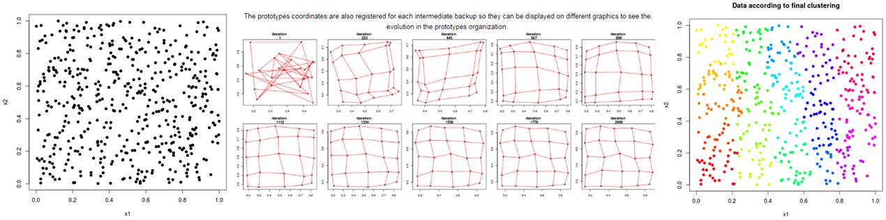
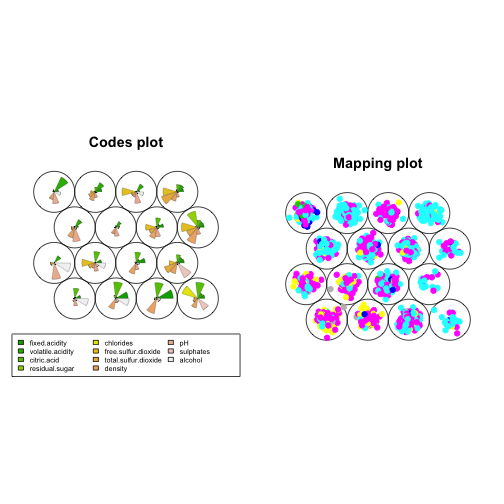
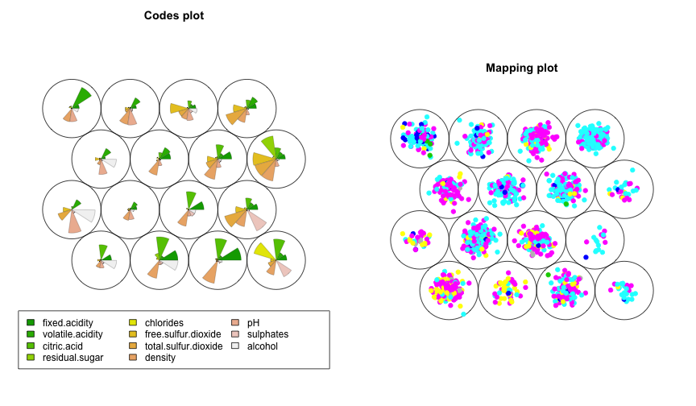
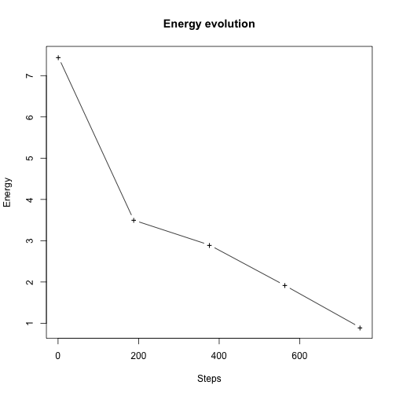
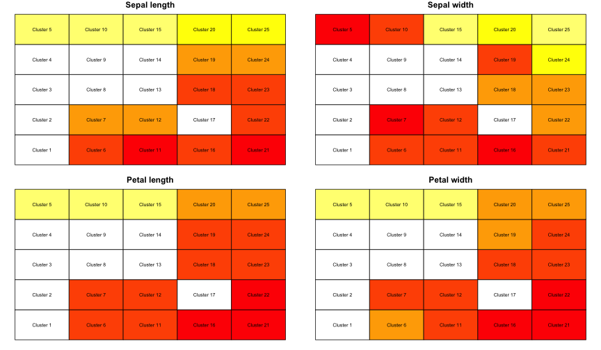

SOM (Self-Organizing Maps) en R
========================================================
author: Pablo Tempone
date: 
autosize: true

Temario
========================================================

- Qué es SOM?
- Ejemplo en R
- Implementación en ambientes no conectados


Qué es SOM? - Introducción
========================================================

Es un tipo de Red Neuronal que se utiliza para aprendizaje **no** supervisado.

- Consiste en una grilla de cuadrados o hexágonos.
- En cada grilla se concentran datos similares, **grillas vecinas** contienen datos con algún grado de similitud entre sí.
- Cada grilla está representada por un valor de referencia, conceptualmente similar al centroide en **k-medias**.
- Al inicio del aprendizaje a cada valor de referencia se el asignan pesos al **azar**, que se van ajustando a medida que se presentan nuevos datos.
- Las conexiones entre neuronas y el concepto de vecindad permite acomodar su estructura interna a la topología de los datos de entrada


Qué es SOM? - Algoritmo: Parte 1
========================================================

1. Definir el **tamaño** de la grilla.
2. Inicializar los pesos ($w$) con valores al azar y seleccionar un tamaño de vecinadario inicial suficientemente grande (que cubra la mitad de las celdas).
3. Seleccionar un registro al azar $x_i$ del dataset.
4. Encontrar el nodo k que tenga el vector de pesos $w_k$ más cercano a $x$. Para esto se puede la distancia Euclídea ($d$).
$$d(x-w_k)=min_i[d(x-w_i)]$$

Qué es SOM? - Algoritmo: Parte 2
========================================================

5.Actualizar los pesos de los nodos en la vecindad de k utilizando la regla de aprendizaje de Kohonen:
$$Si\ i\ \in\ N_k \rightarrow\ w_i^{new} = w_i^{old}+\infty h_{ik}(x-w_i)$$
$$Si\ i\ \notin\ N_k \rightarrow\ w_i^{new} = w_i^{old}$$
El parámetro $\infty$ es la rapidez de aprendizaje, que varia entre 0 y 1, y $h_{ik}$ es un kernel de vecindad y puede ser de diferentes tipos, por ejemplo, gaussiano:
$$h_{ik} = exp[-\frac{d(r_i-r_k)^2}{2\sigma^2}]$$
Donde $r_i$ y $r_k$ son las posiciones de las celdas $i$ y $k$ en la grilla y $\sigma$ es el radio de la vecindad.

Qué es SOM? - Algoritmo: Parte 3
========================================================

Este paso del algoritmo es el que determina que los datos en dos grillas vecinas sean más similares entre sí que con los datos presentes en grillas más lejanas. El kernel gaussiano determina que la magnitud de los cambios en los pesos baje a medida que las grillas del vecindario están más alejadas de la que recibió el nuevo objeto.

6.Disminuir la rapidez de aprendizaje.

7.Repetir los pasos 3-6 hasta que los pesos se estabilicen.

Qué es SOM? - Visualmente
========================================================





Ejemplo en R - Librería Kohonen
========================================================


```r
# La primera vez:
# install.packages("kohonen")
library(kohonen)
```


```r
url.tinto <- "http://archive.ics.uci.edu/ml/machine-learning-databases/wine-quality/winequality-red.csv"
tinto <- read.csv(url.tinto, header=T, sep=";")
tinto.st <- scale( tinto[, -12] )
tinto.som <- som(as.matrix( tinto.st), somgrid(4,4,"hexagonal"))

par(mfrow = c(1,2) )
plot(tinto.som, type="codes")
plot(tinto.som, type="mapping", col = tinto$quality, pch=19)
```



Ejemplo en R - Librería Kohonen
========================================================



Ejemplo en R - Librería SOMbrero
========================================================


```r
# La primera vez:
# install.packages("SOMbrero")
library(SOMbrero)
```

Ejemplo en R - Librería SOMbrero
========================================================

Usamos Iris como ejemplo.


```r
set.seed(255)
# run the SOM algorithm with verbose set to TRUE
iris.som <- trainSOM(x.data=iris[,1:4], verbose=FALSE, nb.save=5)

iris.som
```

```
      Self-Organizing Map object...
         online learning, type: numeric 
         5 x 5 grid with square topology
         neighbourhood type: gaussian 
         distance type: euclidean 
```

Ejemplo en R - Librería SOMbrero
========================================================


```r
par(mfrow = c(1,1) )
plot(iris.som, what="energy")
```



Ejemplo en R - Librería SOMbrero
========================================================


```r
par(mfrow=c(2,2))
plot(iris.som, what="obs", type="color", variable=1, print.title=TRUE, main="Sepal length")
plot(iris.som, what="obs", type="color", variable=2, print.title=TRUE, main="Sepal width")
plot(iris.som, what="obs", type="color", variable=3, print.title=TRUE, main="Petal length")
plot(iris.som, what="obs", type="color", variable=4, print.title=TRUE, main="Petal width")
```

Ejemplo en R - Librería SOMbrero
========================================================




Implementación en ambientes no conectados - Ejemplo SOMbrero
========================================================


1.	Generación de la base en SQL
2.	Escalado de la base para preparación en el algoritmo (se puede realizar en SQL también): $X' = \frac{X - X_{min}}{X_{max}-X_{min}}$
3.	Se ejecuta SOM en R con la base generada en SQL. Agregar **nb.save=0** y **scaling='none'** para reducir tiempos de ejecución una vez que se esté conforme con el resultado.
4.	Se exporta los prototipos de cada cluster, sería como el cliente más representativo de ese cluster. Un archivo que va a tener tantos registros como grupos haya. **Solamente es necesario la primera vez, luego este paso no se usa.**

Implementación en ambientes no conectados - Ejemplo SOMbrero
============================================================

5.	Se calcula la distancia de cada cliente a ese cluster y se lo etiqueta con el que menos distancia tenga. Ej: **sujeto_unico,sqrt(power(base_escalada.variable_1-prototipo1.variable1,2)+power(base_escalada.variable2-prototipo1.variable2,2))**
6.  Case o ifelse en sql para decir a que cluster está más cerca.

Referencias
========================================================

+ Tuevo Kohonen, 1990, [The Self-Organizing Map](https://sci2s.ugr.es/keel/pdf/algorithm/articulo/1990-Kohonen-PIEEE.pdf)
+ Mat Buckland, 2004, [Kohonen's Self Organizing Feature Maps](http://www.ai-junkie.com/ann/som/som1.html)
+ Marcelo Soria, [SOM (self organizing maps)](http://inba.agro.uba.ar/curso_r/modulo_13.pdf)
